# **End-to-End Azure Data Engineering Project — CRM Sales Pipeline Analytics**

This project showcases a **real-world, production-grade Azure Data Engineering pipeline** built to ingest, clean, transform, secure, monitor, and analyze CRM Sales Pipeline data.
It demonstrates how modern data platforms integrate Azure services end-to-end to deliver **business-ready insights**.

---

# 📌 **Project Architecture**

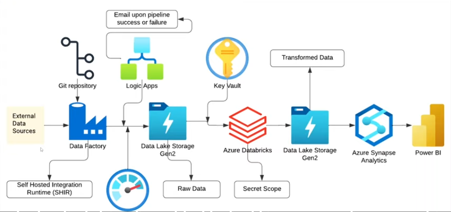

This solution covers the full data lifecycle:

* **On-Premises Files → SHIR → Azure Data Factory**
* **Azure Data Lake Storage Gen2 (Bronze → Silver → Gold layers)**
* **Azure Databricks for transformation**
* **Azure Key Vault for secret protection**
* **Logic Apps + Azure Monitor for alerts**
* **Synapse Serverless SQL for analytics**
* **Power BI for final dashboards**

---

# 🧩 **1. Data Ingestion Layer (On-Prem to Cloud)**

## 🔹 Using SHIR for On-Premises Ingestion

Files located on your local machine inside the **crm-data** folder were ingested using:

* **Self-Hosted Integration Runtime (SHIR)**
* Azure Data Factory’s **Copy Data** activity
* Linked Service using on-prem folder path
* Secure authentication using SHIR node

This ingested the following files:

* `accounts.csv`
* `data_dictionary.csv`
* `products.csv`
* `sales_pipeline.csv`
* `sales_teams.csv`

### Pipeline Activities (Copy Data)

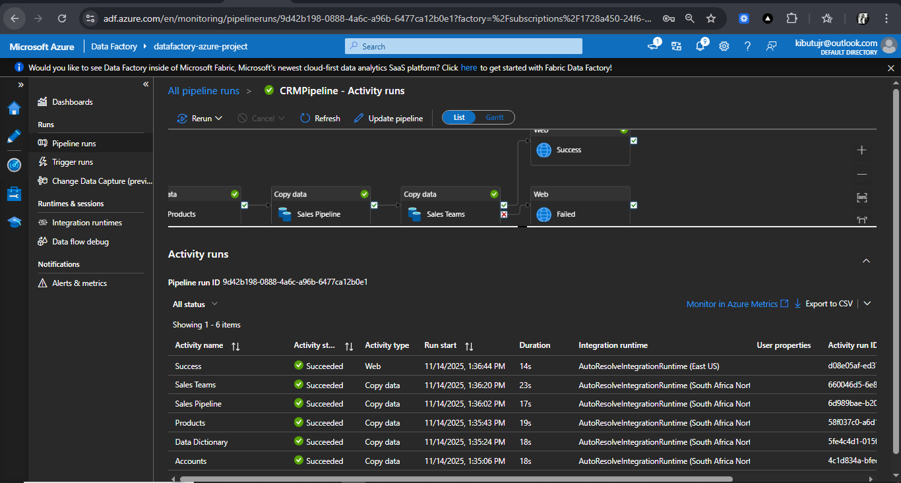

Each dataset was copied into the **Bronze Layer** of ADLS.

## 🔹 Using Azure IR (AutoResolveIntegrationRuntime)

Also tested ingestion using **Azure IR**, and both methods worked:

-📌 **SHIR** worked when ingesting on-prem files.
-📌 **Azure IR** worked when files were already uploaded to ADLS.

This demonstrates knowledge of **when each IR is required** — an important skill for Azure Data Engineers.

---

# 🗂 **2. Data Storage — Azure Data Lake Storage (ADLS Gen2)**

All ingested data lands in ADLS under structured folders:

```

/transformed-data/

```

Transformation-ready files are placed in transdormed-data.


---

# 🔄 **3. Data Cleaning & Transformation — Azure Databricks**

Databricks notebooks performed:

* Column renaming
  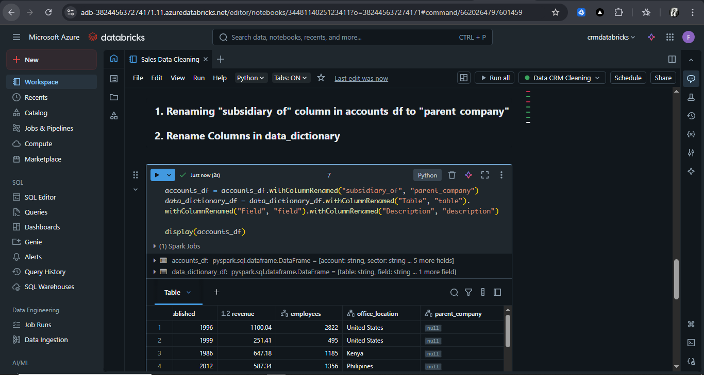
  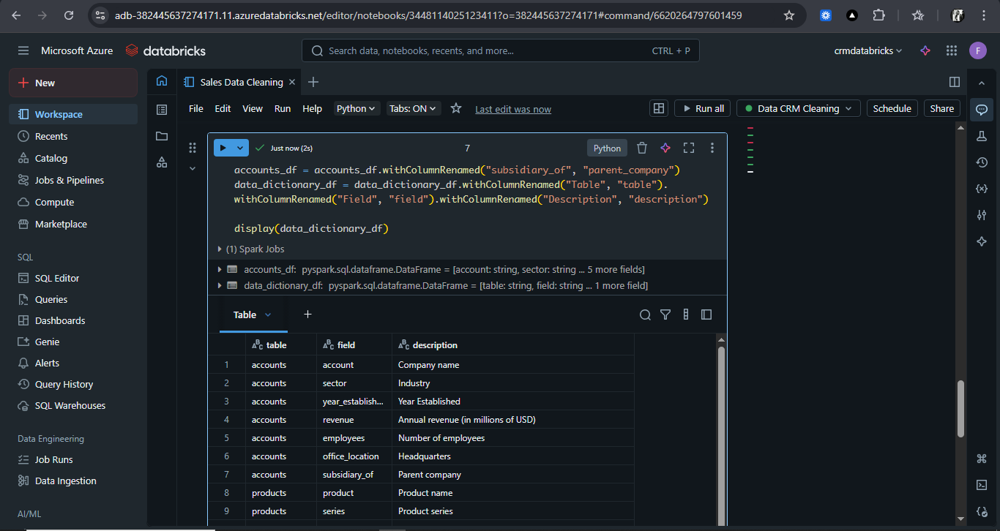

* Null handling
  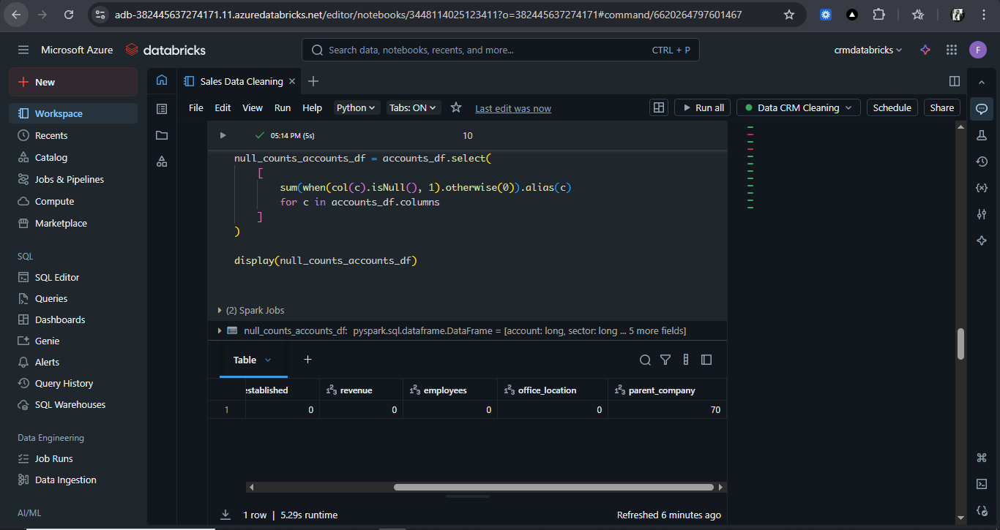
  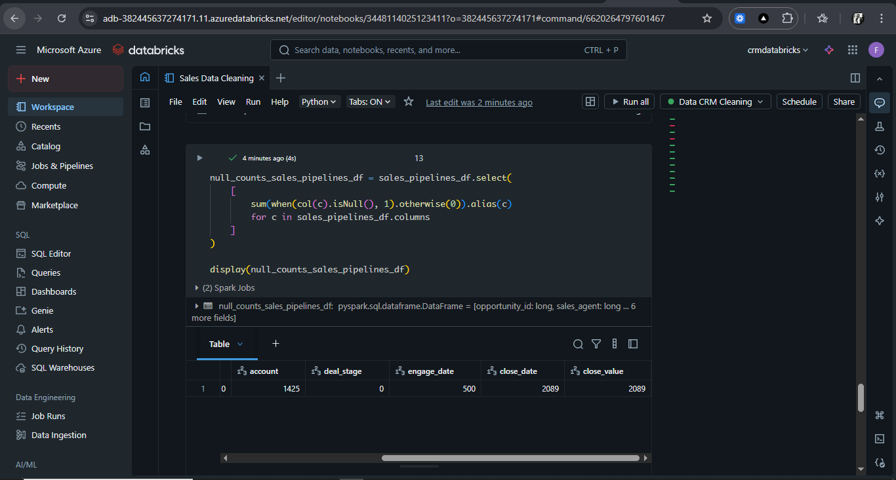

* Data standardization

* Creating curated tables

* Writing Delta format outputs to **Silver → Gold**

Databricks notebooks were mounted using secure credentials:

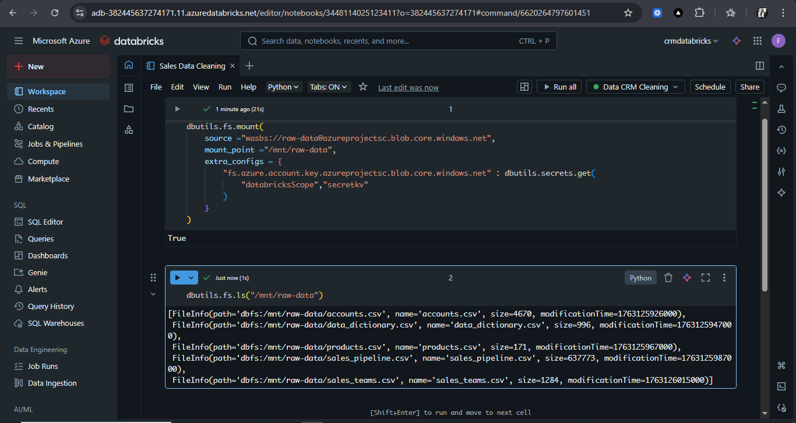

---

# 🔐 **4. Security Layer — Key Vault + Secret Scope**

* SQL passwords, storage keys, and tokens were protected in **Key Vault**.
* Databricks accessed these secrets through **Secret Scopes**.
* No credentials were hardcoded anywhere.

---

# 🔔 **5. Monitoring & Alerts**

### 🔹 Azure Monitor

Used for pipeline run health:

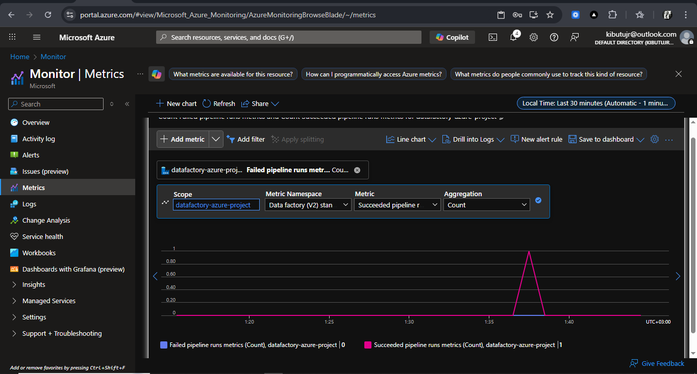

### 🔹 Logic App Email Alerts

Email alerts for success/failure:

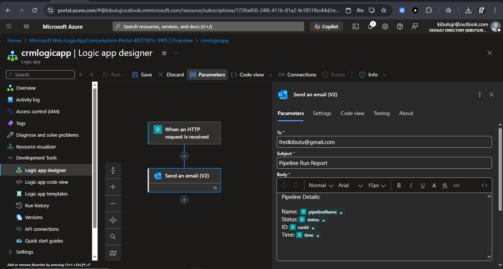

### 🔹 Email Alerts
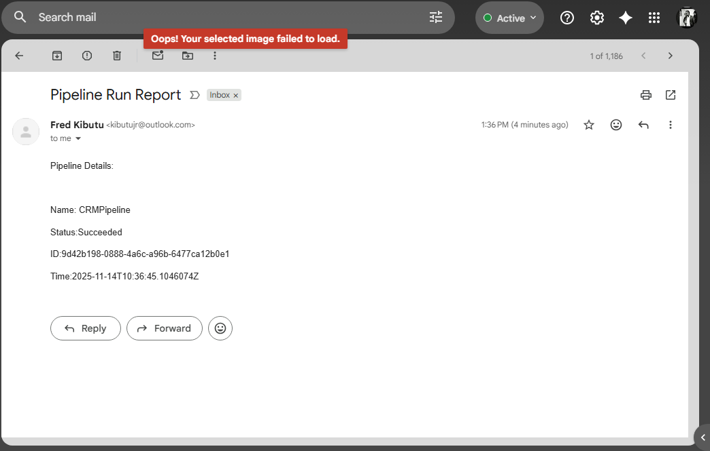

---

# 🧠 **6. Analytics Layer — Azure Synapse Serverless SQL**

Cleaned Gold data was queried using Synapse’s SQL Workspace.

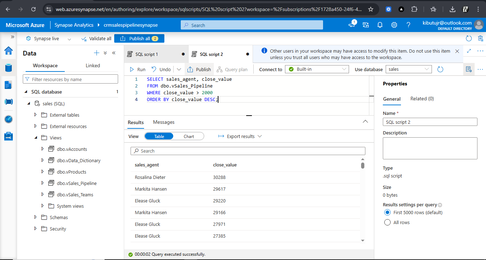

Views included:

* `dbo.vAccounts`
* `dbo.vData_Dictionary`
* `dbo.vProducts`
* `dbo.vSales_Pipeline`
* `dbo.vSales_Teams`

These views powered the Power BI dashboards.

---

# 📊 **7. Business Intelligence — Power BI Dashboard**

The final Power BI report provides **critical business insights** for decisions in sales strategy, agent performance, product performance, and revenue distribution.

## KPIs

* **Total Deals Value:** 6,711
* **Won Deals:** 4,238
* **Lost Deals:** 2,473
* **Win Rate:** **63%** (0.63)

**Win Rate Measure:**

```DAX
WinRate% =
DIVIDE(
    CALCULATE(
        COUNTROWS('Sales Pipeline'),
        'Sales Pipeline'[deal_stage] = "won"
    ),
    CALCULATE(
        COUNTROWS('Sales Pipeline'),
        'Sales Pipeline'[deal_stage] = "won"
            || 'Sales Pipeline'[deal_stage] = "lost"
    ),
    0
)
```

## Visuals Included

1. **Sales Agent by Close Value** — Clustered bar chart
2. **Monthly Sales Trend** — Line chart
3. **Office Locations by Revenue** — Map visual
4. **Top Companies by Revenue** — Funnel chart
5. **Top Products by Deal Wins** — Column chart
6. **Revenue by Sector** — Donut chart

### Embedded Report (PDF used in repository)

✔ The Power BI Report (PDF) is included in the repo.

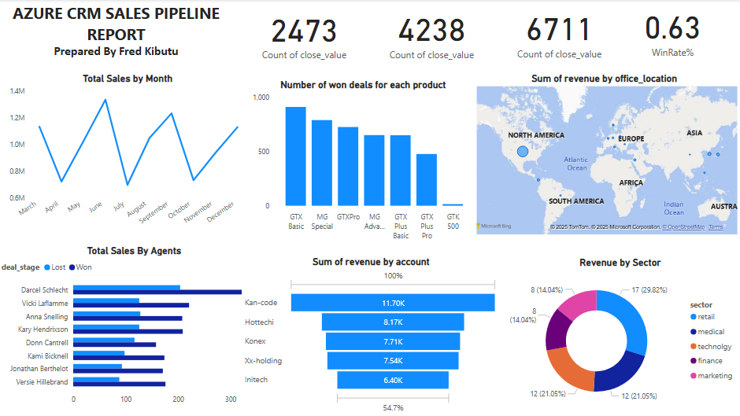

---

# 🎯 **Why This Project Matters**

This solution represents a **real enterprise-grade data platform**.
It demonstrates your ability to:

* Build scalable ingestion pipelines
* Handle real messy datasets
* Implement best practices in security
* Monitor using Azure-native tools
* Transform data using Apache Spark
* Serve business-ready analytics
* Build compelling BI dashboards

It proves I can take a business problem from **raw data → insights → decisions**.

---

# 📌 **Technologies Used**

* **Azure Data Factory (ADF)**
* **Self-Hosted Integration Runtime (SHIR)**
* **Azure Integration Runtime (AutoResolve)**
* **Azure Data Lake Storage Gen2**
* **Azure Databricks (Spark + Delta Lake)**
* **Azure Key Vault**
* **Azure Monitor**
* **Logic Apps**
* **Azure Synapse Serverless SQL**
* **Power BI**

---

## Contact

If you have any questions, suggestions, or would like to collaborate, feel free to reach out:

- **Name:** Fred Kibutu  
- **Email:** [kibutujr@gmail.com](mailto:kibutujr@gmail.com)  
- **LinkedIn:** [linkedin.com/in/fred-kibutu](https://www.linkedin.com/in/fred-kibutu/)  
- **GitHub:** [github.com/KibutuJr](https://github.com/KibutuJr)
- **Portfolio:** [My Portfolio](https://kibutujr.vercel.app/)  

---
